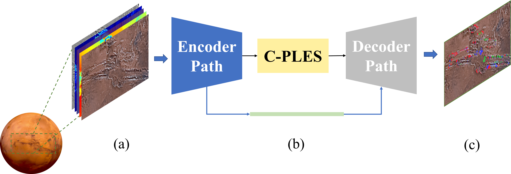

# C-PLES: Contextual Progressive Layer Expansion with Self-attention

In this research, we present C-PLES (Contextual Progressive Layer Expansion with Self-attention), a deep learning architecture for multi-class landslide segmentation in the Valles Marineris (VM) on Mars. 

Figure 1. Location of Valles Marineris (VM) on Mars used for landslide mapping in this study. (a) The multi-modality imagery used to train the (b) proposed segmentation model. (c) The output landslide segmentation map.

## Model

Figure 2. Detailed illustration of the proposed C-PLES architecture

## Results

Figure 3. Visual comparison of multi-class Martian landslide segmentation outputs. (a) Input RGB image, (b) the segmentation mask (ground truth), (c) - (i) the segmentation outputs of experimented DL architectures: U-Net, Attention U-Net, TransUNet, R2UNet, UNet 3+, UNet++, and Swin-Unet, (j) the proposed C-PLES, respectively

## Citation

If you use [C-PLES](https://github.com/MAIN-Lab/C-PLES/) in your research, we would appreciate a citation to the original paper:
